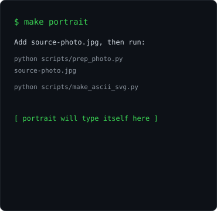

<div align="center">

<h3><code>sehdie@github ~ $ ./contributions.sh</code></h3>


<br><br>

<h3><code>sehdie@github ~ $ whoami</code></h3>
<table>
  <tr>
    <td valign="top"></td>
    <td valign="top"></td>
  </tr>
</table>

</div>

## Personalize this profile

1. Replace the sample text in `scripts/make_info_card.py` with your role, stack, and highlights, then run `python scripts/make_info_card.py`.
2. Add a portrait photo as `source-photo.jpg` (it is intentionally not included). Install the optional portrait dependencies and run:

   ```sh
   python -m pip install -r scripts/requirements-portrait.txt
   python scripts/prep_photo.py source-photo.jpg
   python scripts/make_ascii_svg.py
   ```

3. Run `python scripts/fetch_contributions.py` and `python scripts/render_heatmap_svg.py` to generate the initial live contribution graph. The daily workflow keeps it current afterward.
4. Commit the generated SVGs and workflow to a public repository named exactly `sehdie` under your GitHub account (`sehdie/sehdie`). Enable Actions if prompted.

The contribution graph uses GitHub's public contribution-calendar page; it requires no personal access token. The scheduled workflow only installs `scripts/requirements.txt`, not the optional image-processing dependencies.
